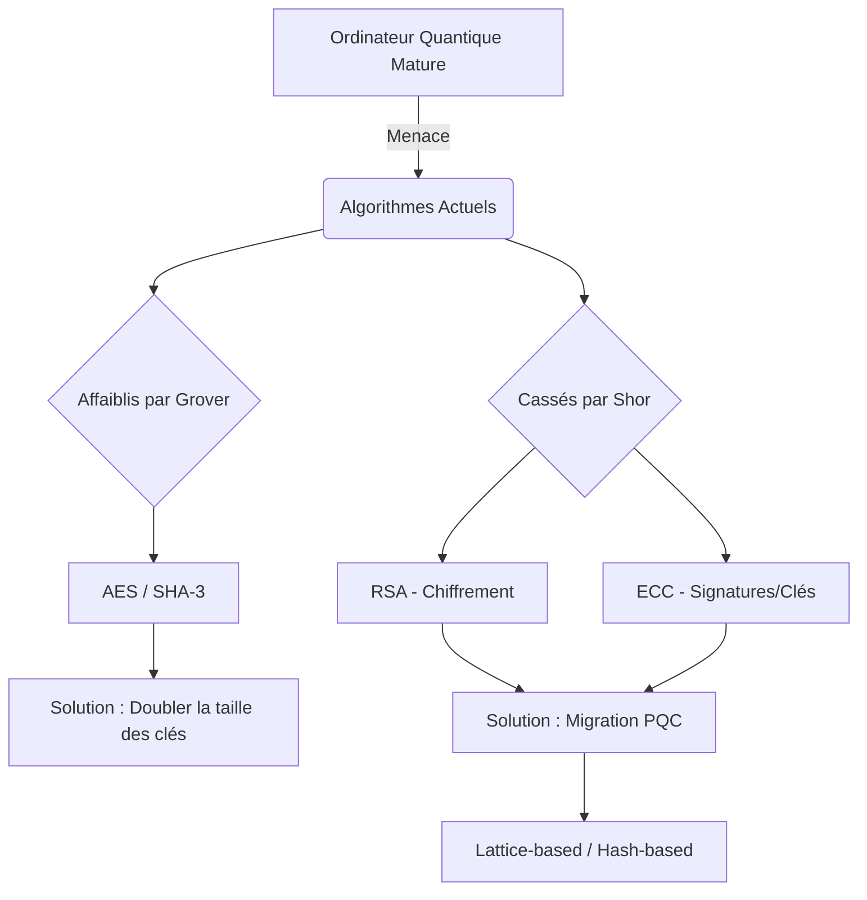

# Nom : KAYA #
# Prénom : ISHAK #
## Classe : BTS SIO SISR 1 ##
#### Date de naissance : 10/01/2007 ####
#### Etablissement d'origine : Lycée Camille Claudel 2022/2024 ####
#### Bac obtenu et spécialité : Bac général, spécialités mathématiques/NSI (physique-chimie abandonnée) ####
#### Année d'optention : 2025 ####
#### Avez-vous déjà effectué une autre formation après le bac ? : Non ####
#### Ville de résidence: Meulan/Les Mureaux, Les Yvelines ####
#### Moyen de transport : 25 min de voitures ####
#### Mail personnel : k.sharki6154@gmail.com ####
#### Pourquoi avoir choisi le BTS-SIO de L'Ensitech : Ce que je souhaite faire. ####
#### Travaillez-vous en dehors des cours : OUI ####
#### Quelles connaissances ou compétences en informatique avez-vous ? : J'ai pratiqué le langage python 
depuis 3ans, je connais Word et un peu Exel. J'ai déjà crée le tout début d'un site.
####
#### Projet Professionnel : BAC +5, Ingernieur en Cybersécurité ####
## Veille technologique : La Cryptographie Post-Quantique (PQC) et la sécurité des communications ##
###
L'émergence de l'informatique quantique représente une menace sans précédent pour les protocoles de chiffrement actuels.
Ma veille porte sur la transition vers la cryptographie post-quantique, qui vise à développer des systèmes cryptographiques 
sécurisés contre les ordinateurs classiques et quantiques. Je m'intéresse particulièrement aux standards du NIST et aux 
recommandations de l'ANSSI pour préparer la migration des infrastructures 
(VPN, certificats SSL/TLS) vers des algorithmes dits « résistants au quantique ».
###

## ⚖️ Analyse de l'impact Quantique

Le schéma ci-dessus illustre la dualité de la menace quantique sur nos standards actuels. Ma veille se concentre sur deux axes majeurs de remédiation :

### 1. La fin de la Cryptographie Asymétrique (Shor)
L'algorithme de Shor rend caduques les méthodes basées sur la factorisation (RSA) et le logarithme discret (ECC). 
* **Risque :** Interception et déchiffrement rétroactif des communications ("Harvest Now, Decrypt Later").
* **Réponse :** Migration vers des algorithmes de **Cryptographie Post-Quantique (PQC)**, principalement basés sur les réseaux euclidiens (Lattices), qui résistent aux attaques de Shor.

### 2. La résistance de la Cryptographie Symétrique (Grover)
Contrairement à RSA, les algorithmes symétriques comme **AES** et les fonctions de hachage comme **SHA-3** ne sont pas totalement brisés, mais "affaiblis" par l'algorithme de Grover.
* **Risque :** Division par deux de la sécurité effective (un AES-128 ne fournirait plus que 64 bits de sécurité).
* **Réponse :** Utilisation systématique de clés plus longues (**AES-256**) pour maintenir un niveau de sécurité post-quantique acceptable.

---

## 🛡️ Stratégie de Transition (Recommandations ANSSI)
L'ANSSI préconise une phase de transition dite **"Hybride"**. Cette approche consiste à combiner :
1.  Un algorithme de sécurité classique (ex: **ECDH**) pour assurer une protection contre les menaces d'aujourd'hui.
2.  Un algorithme post-quantique (ex: **ML-KEM / Kyber**) pour se protéger contre les futures menaces quantiques.

*L'objectif est de garantir que la sécurité globale est au moins égale à la plus forte des deux méthodes.*

